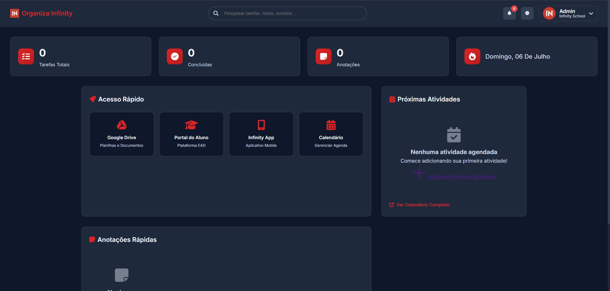
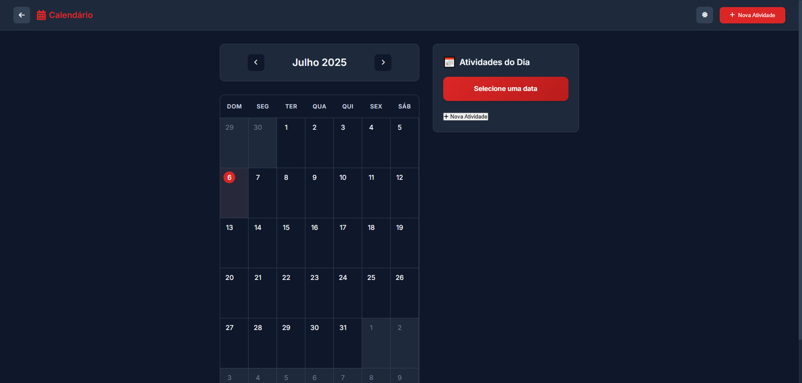
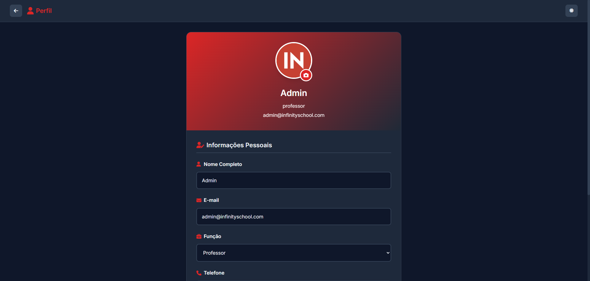

# Organiza Infinity

Sistema de organização e produtividade para funcionários da Infinity School, desenvolvido para o Hackathon Infinity School 2025.

## 📋 Sobre o Projeto

O **Organiza Infinity** é um aplicativo web completo que oferece ferramentas de organização e produtividade especificamente projetadas para os funcionários da Infinity School. O sistema inclui calendário interativo, sistema de anotações, dashboard personalizado e muito mais.

## 🚀 Funcionalidades

### ✅ Implementadas

- **Dashboard Principal**
  - Menu central com acesso rápido
  - Links para Google Drive, Portal do Aluno e Infinity App
  - Visão geral de eventos próximos
  - Área de notificações

- **Sistema de Autenticação**
  - Login simulado 
  - Gerenciamento de sessão
  - Perfil de usuário personalizado

- **Calendário Interativo**
  - Visualização mensal
  - Criação e edição de tarefas
  - Organização por categorias 
  - Sistema de cores por categoria
  - Sidebar com tarefas do dia selecionado

- **Sistema de Anotações**
  - Criação de notas rápidas estilo Post-it
  - Organização por cores
  - Edição e exclusão de anotações

- **Perfil do Usuário**
  - Edição de informações pessoais
  - Upload de avatar 
  - Biografia e informações de contato

- **Tema Escuro/Claro**
  - Alternância entre modos
  - Persistência da preferência

- **Design Responsivo**
  - Adaptação para desktop, tablet e mobile
  - Interface moderna com cores da Infinity School

## 🛠️ Tecnologias Utilizadas

- **Frontend:**
  - HTML5
  - CSS3 (Custom Properties, Grid, Flexbox)
  - JavaScript ES6+ (Classes, Modules, LocalStorage)
  - Font Awesome (Ícones)
  - Google Fonts (Inter)

- **Funcionalidades:**
  - LocalStorage para persistência de dados
  - Responsive Design
  - Animações CSS
  - Gerenciamento de estado com JavaScript

## 📁 Estrutura do Projeto

\`\`\`
organiza-infinity/
├── index.html              # Página de login
├── dashboard.html           # Dashboard principal
├── calendar.html           # Calendário interativo
├── profile.html            # Perfil do usuário
├── package.json
├── styles/
│   ├── main.css            # Estilos principais e variáveis
│   ├── login.css           # Estilos da página de login
│   ├── dashboard.css       # Estilos do dashboard
│   ├── calendar.css        # Estilos do calendário
│   └── profile.css         # Estilos do perfil
├── scripts/
│   ├── auth.js             # Gerenciamento de autenticação
│   ├── dashboard.js        # Lógica do dashboard
│   ├── calendar.js         # Lógica do calendário
│   ├── notes.js            # Gerenciamento de notas
│   ├── theme.js            # Gerenciamento de tema
│   └── profile.js          # Gerenciamento de perfil
└── README.md               # Documentação
\`\`\`

## 🎨 Design System

### Cores da Infinity School
- **Primária:** \`#6366f1\` (Índigo)
- **Secundária:** \`#8b5cf6\` (Roxo)
- **Accent:** \`#06b6d4\` (Ciano)

### Tipografia
- **Fonte:** Inter (Google Fonts)
- **Pesos:** 300, 400, 500, 600, 700

## 🚀 Como Rodar Localmente

1. **Abra o projeto:**
   - Abra o arquivo \`index.html\` em um navegador web
   - Ou use um servidor local como Live Server (VS Code)

2. **Login:**
   - Use qualquer email e senha para entrar
   - O sistema aceita credenciais fictícias para demonstração

## 📱 Capturas de Tela

### Tela de Login 
- Interface limpa com gradiente da marca
- Formulário de autenticação
- Informações sobre o demo

### Dashboard 
- Menu de acesso rápido
- Eventos próximos
- Anotações rápidas
- Sistema de notificações

### Calendário 
- Visualização mensal completa
- Criação e edição de tarefas
- Organização por categorias
- Sidebar com tarefas do dia

### Perfil 
- Edição de informações pessoais
- Mudança de avatar
- Validação de formulários

## 🔧 Explicação Técnica

### Arquitetura
O projeto utiliza uma arquitetura modular com separação clara de responsabilidades:

- **Classes JavaScript:** Cada funcionalidade principal é encapsulada em uma classe
- **LocalStorage:** Persistência de dados no navegador
- **CSS Custom Properties:** Sistema de cores e temas dinâmicos
- **Event-Driven:** Comunicação entre componentes via eventos

### Fluxo da Aplicação
1. **Autenticação:** Verificação de login e redirecionamento
2. **Dashboard:** Carregamento de dados e exibição de resumos
3. **Navegação:** SPA-like navigation entre páginas
4. **Persistência:** Salvamento automático no LocalStorage

### Organização de Pastas
- \`styles/\`: Estilos organizados por página/componente
- \`scripts/\`: Lógica JavaScript modular
- Arquivos HTML separados para cada página principal

## 👥 Desenvolvedor

- **Desenvolvedor:** Jefferson Lucas 
- **Curso:** Programação Full Stack
- **Turno:** Manhã

## 📄 Licença

Este projeto foi desenvolvido para o Hackathon Infinity School 2025 e é destinado apenas para fins educacionais e de demonstração.

---

**Organiza Infinity** - Transformando a produtividade na educação! 🚀
